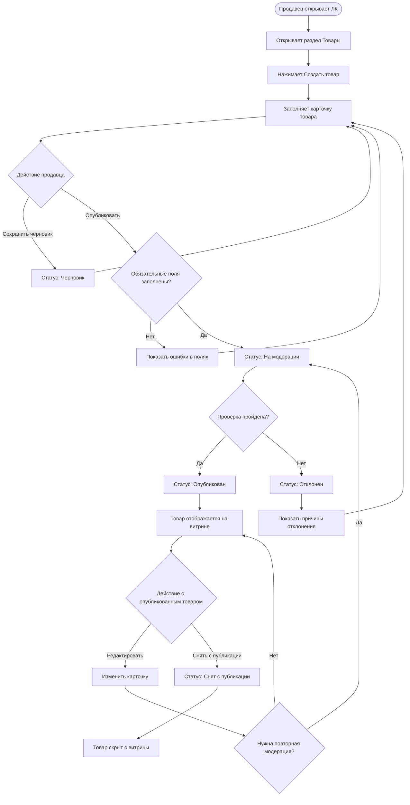

# Задача 2. Публикация товара на витрине маркетплейса

## 1. Верхнеуровневая постановка

### User Story

Как продавец маркетплейса, я хочу создать карточку товара в Личном кабинете и отправить ее на публикацию, чтобы товар появился на витрине и стал доступен покупателям для просмотра и заказа.

### Ценность для продавца

Продавец может самостоятельно разместить товар без обращения в поддержку или к менеджеру. При этом он видит статус карточки и понимает, что нужно исправить, если публикация не прошла.

### Критерии приемки

- Продавец может создать новую карточку товара.
- Карточку можно сохранить как черновик без публикации.
- Перед публикацией система проверяет обязательные поля и корректность данных.
- После отправки карточка получает статус «На модерации».
- Если проверка пройдена, товар получает статус «Опубликован» и появляется на витрине.
- Если проверка не пройдена, продавец видит причины отклонения.
- Отклоненную карточку можно исправить и отправить повторно.
- Текущий статус карточки отображается в Личном кабинете.

---

## 2. Участники процесса

### Основной пользователь

- Продавец

### Системы и сервисы

- Личный кабинет продавца;
- сервис каталога товаров;
- витрина маркетплейса;
- сервис модерации;
- сервис уведомлений.

### Дополнительный участник

- Модератор, если для части карточек предусмотрена ручная проверка.

---

## 3. Основной Use Case

### UC-1. Опубликовать товар на витрине

| Поле | Описание |
|---|---|
| ID | UC-1 |
| Название | Публикация товара |
| Основной актер | Продавец |
| Цель | Разместить товар на витрине маркетплейса |
| Триггер | Продавец нажимает кнопку «Опубликовать» в карточке товара |

### Предусловия

- Продавец авторизован в Личном кабинете.
- У продавца есть право размещать товары.
- Продавец находится в разделе создания или редактирования товара.
- Для выбранной категории известен набор обязательных полей.

### Основной сценарий

1. Продавец открывает раздел «Товары» в Личном кабинете.
2. Нажимает «Создать товар».
3. Система открывает форму создания карточки.
4. Продавец выбирает категорию товара.
5. Система показывает поля, которые нужно заполнить для выбранной категории.
6. Продавец заполняет данные:
   - название;
   - описание;
   - категорию;
   - характеристики;
   - цену;
   - остаток;
   - фотографии;
   - параметры доставки, если они задаются на уровне товара.
7. Продавец нажимает «Опубликовать».
8. Система проверяет обязательные поля и форматы данных.
9. Если ошибок нет, карточка сохраняется в статусе «На модерации».
10. Карточка проходит автоматическую или ручную проверку.
11. Если нарушений нет, система присваивает карточке статус «Опубликован».
12. Данные товара передаются в каталог и на витрину.
13. Товар становится доступен покупателям.
14. Продавец получает уведомление об успешной публикации.

### Постусловия успешного сценария

- Карточка находится в статусе «Опубликован».
- Товар отображается на витрине маркетплейса.
- Покупатели могут открыть карточку товара.
- В истории карточки сохранено событие публикации.

---

## 4. Альтернативные сценарии

### UC-1.A1. Сохранение черновика

1. Продавец заполняет часть данных.
2. Нажимает «Сохранить черновик».
3. Система сохраняет карточку в статусе «Черновик».
4. Карточка не отправляется на модерацию и не отображается на витрине.
5. Продавец может вернуться к заполнению позже.

### UC-1.A2. Не заполнены обязательные поля

1. Продавец нажимает «Опубликовать».
2. Система проверяет карточку.
3. Система находит незаполненные или некорректные поля.
4. Проблемные поля подсвечиваются, рядом показывается текст ошибки.
5. Карточка остается в текущем статусе и не отправляется на модерацию.
6. Продавец исправляет данные и повторяет отправку.

### UC-1.A3. Карточка отклонена

1. Карточка находится в статусе «На модерации».
2. Сервис модерации или модератор находит нарушение.
3. Карточка получает статус «Отклонен».
4. Продавец видит список причин отклонения.
5. Продавец исправляет данные.
6. Карточку можно повторно отправить на модерацию.

### UC-1.A4. Техническая ошибка

1. Продавец нажимает «Опубликовать».
2. При сохранении или отправке карточки возникает ошибка.
3. Система показывает сообщение о проблеме.
4. Уже введенные данные не теряются.
5. Продавец может повторить действие позже.

---

## 5. Дополнительные Use Cases

### UC-2. Редактировать опубликованный товар

| Поле | Описание |
|---|---|
| Основной актер | Продавец |
| Цель | Обновить данные опубликованного товара |
| Предусловие | Товар находится в статусе «Опубликован» |

Сценарий:

1. Продавец открывает опубликованную карточку.
2. Изменяет данные товара.
3. Сохраняет изменения.
4. Система определяет, нужна ли повторная модерация.
5. Если повторная модерация не нужна, изменения применяются сразу.
6. Если повторная модерация нужна, карточка переходит в статус «На модерации».
7. После успешной проверки обновленная карточка отображается на витрине.

### UC-3. Снять товар с публикации

| Поле | Описание |
|---|---|
| Основной актер | Продавец |
| Цель | Убрать товар с витрины |
| Предусловие | Товар находится в статусе «Опубликован» |

Сценарий:

1. Продавец открывает опубликованный товар.
2. Нажимает «Снять с публикации».
3. Система запрашивает подтверждение.
4. Продавец подтверждает действие.
5. Товар получает статус «Снят с публикации».
6. Карточка перестает отображаться на витрине для покупателей.

### UC-4. Повторно отправить отклоненный товар

| Поле | Описание |
|---|---|
| Основной актер | Продавец |
| Цель | Исправить замечания и повторно отправить товар на проверку |
| Предусловие | Товар находится в статусе «Отклонен» |

Сценарий:

1. Продавец открывает отклоненную карточку.
2. Система показывает причины отклонения.
3. Продавец исправляет данные.
4. Нажимает «Отправить повторно».
5. Система снова проверяет обязательные поля.
6. Карточка переходит в статус «На модерации».

---

## 6. Функциональные требования

### Карточка товара

В форме карточки должны быть доступны поля:

- название товара;
- категория;
- описание;
- характеристики;
- цена;
- остаток;
- фотографии;
- параметры доставки, если они заполняются для конкретного товара.

### Проверка данных

При публикации нужно проверять:

- заполнение обязательных полей;
- корректность цены;
- корректность остатка;
- формат и размер фотографий;
- ограничения по длине названия и описания;
- обязательные характеристики для выбранной категории.

### Статусы карточки

Для карточки товара нужны статусы:

- Черновик;
- На модерации;
- Опубликован;
- Отклонен;
- Снят с публикации.

### Модерация

Перед публикацией карточка должна пройти проверку. Проверка может включать:

- запрещенные товары;
- запрещенные слова;
- неподходящие фотографии;
- некорректное описание;
- несоответствие выбранной категории;
- дублирующиеся карточки.

### Уведомления

Продавец должен получать уведомления:

- об успешной публикации;
- об отклонении карточки;
- о необходимости исправить данные;
- о технической ошибке, если публикация не была выполнена.

### История изменений

В истории карточки желательно фиксировать:

- кто выполнил действие;
- дату и время действия;
- новый статус карточки;
- причину отклонения, если карточка была отклонена.

---

## 7. Бизнес-правила

- Публикация доступна только авторизованному продавцу.
- У продавца должно быть право размещать товары.
- Набор обязательных полей зависит от категории.
- Товар нельзя опубликовать без обязательных данных.
- Товар нельзя вывести на витрину без успешной проверки.
- Черновик, отклоненный товар и снятый с публикации товар не отображаются на витрине.
- После исправления отклоненной карточки товар проходит проверку повторно.

---

## 8. Нефункциональные требования

- При ошибке публикации введенные данные не должны теряться.
- Проверка обязательных полей выполняется до отправки карточки на модерацию.
- Сообщения об ошибках должны быть понятны продавцу.
- Статус карточки должен быть виден в списке товаров и внутри карточки.
- Изменение статуса фиксируется в журнале.
- После успешной публикации товар должен появиться на витрине без дополнительных действий со стороны продавца.

---

## 9. Диаграмма процесса

---

## 10. Допущения и открытые вопросы

### Допущения

- Модерация может быть автоматической, ручной или смешанной.
- Обязательные поля зависят от категории товара.
- Часть изменений опубликованной карточки может требовать повторной модерации.

### Открытые вопросы

- Какие категории товаров запрещены для публикации?
- Какие поля обязательны для каждой категории?
- Какие требования к фотографиям товара?
- Какие изменения опубликованного товара требуют повторной модерации?
- Есть ли лимит на количество опубликованных товаров у продавца?
- Нужна ли отдельная проверка товара со стороны сотрудников маркетплейса?
- Должен ли товар появляться на витрине сразу после модерации или по расписанию?
- Нужна ли массовая публикация товаров через файл?
- Нужно ли хранить версии карточки товара?
