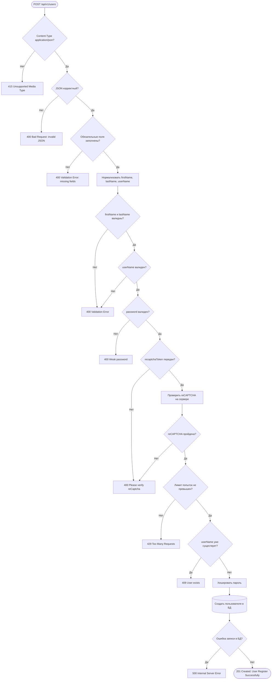

# Задача 3. REST API регистрации пользователя

## Допущения по интерфейсу

По макету регистрации используются поля:

- First Name;
- Last Name;
- UserName;
- Password;
- reCAPTCHA;
- кнопка Register.

На макете также показаны состояния:

- успешная регистрация: `User Register Successfully.`;
- ошибка слабого пароля;
- ошибка существующего пользователя: `User exists!`;
- ошибка reCAPTCHA: `Please verify reCaptcha to register!`.

---

# 3.1. Описание REST API

## HTTP метод и URL

`POST /api/v1/users`

Метод вызывается фронтендом после нажатия кнопки `Register`.

## Заголовки запроса

| Заголовок | Значение | Обязательность | Описание |
|---|---|---:|---|
| Content-Type | application/json | да | Тело запроса передается в JSON |

---

## Входные параметры

| Параметр | Тип | Обязательность | Ограничения |
|---|---|---:|---|
| `firstName` | string | да | 1-50 символов, не пустая строка после trim |
| `lastName` | string | да | 1-50 символов, не пустая строка после trim |
| `userName` | string | да | 3-30 символов, уникален, допустимы латинские буквы, цифры, `_`, `-` |
| `password` | string | да | 8-128 символов, минимум одна цифра, одна заглавная буква, одна строчная буква и один специальный символ |
| `recaptchaToken` | string | да | токен reCAPTCHA, полученный на фронтенде |

---

## Успешный ответ

### HTTP статус

`201 Created`

### Выходные параметры

| Параметр | Тип | Обязательность | Описание |
|---|---|---:|---|
| `id` | string | да | UUID созданного пользователя |
| `firstName` | string | да | имя пользователя |
| `lastName` | string | да | фамилия пользователя |
| `userName` | string | да | уникальное имя пользователя |
| `createdAt` | string | да | дата и время создания в формате ISO 8601 |
| `message` | string | да | сообщение об успешной регистрации |

---

## Ответ с ошибкой

### Общая структура ошибки

| Параметр | Тип | Обязательность | Описание |
|---|---|---:|---|
| `code` | string | да | код ошибки для обработки на фронтенде |
| `message` | string | да | текст ошибки |
| `fields` | array | нет | ошибки по конкретным полям |
| `timestamp` | string | да | дата и время ошибки |
| `path` | string | да | URL метода |
| `traceId` | string | нет | идентификатор запроса для разбора серверных ошибок |

### Объект `fields`

| Параметр | Тип | Обязательность | Описание |
|---|---|---:|---|
| `field` | string | да | поле с ошибкой |
| `message` | string | да | описание ошибки |

---

## Коды ответов

| HTTP код | Тип ошибки | Когда возникает | Код ошибки | Сообщение |
|---|---|---|---|---|
| `201 Created` | успех | пользователь создан | - | `User Register Successfully.` |
| `400 Bad Request` | клиентская | невалидный JSON, пустые поля, неверный формат данных, слабый пароль | `VALIDATION_ERROR` | `Validation error` |
| `400 Bad Request` | клиентская | не передан или не подтвержден reCAPTCHA-токен | `RECAPTCHA_REQUIRED` | `Please verify reCaptcha to register!` |
| `409 Conflict` | клиентская | пользователь с таким `userName` уже существует | `USER_ALREADY_EXISTS` | `User exists!` |
| `415 Unsupported Media Type` | клиентская | запрос отправлен не в формате JSON | `UNSUPPORTED_MEDIA_TYPE` | `Content-Type must be application/json` |
| `429 Too Many Requests` | клиентская | слишком много попыток регистрации | `TOO_MANY_REQUESTS` | `Too many registration attempts. Try again later.` |
| `500 Internal Server Error` | серверная | непредвиденная ошибка сервера или БД | `INTERNAL_ERROR` | `Internal server error. Try again later.` |
| `503 Service Unavailable` | серверная | внешний сервис reCAPTCHA недоступен | `RECAPTCHA_SERVICE_UNAVAILABLE` | `reCAPTCHA service is temporarily unavailable.` |

---

## Пример запроса

```http
POST /api/v1/users HTTP/1.1
Host: api.example.com
Content-Type: application/json
```

```json
{
  "firstName": "ivan",
  "lastName": "ivanov",
  "userName": "ivan",
  "password": "Qwerty123!",
  "recaptchaToken": "03AFcWeA_example_recaptcha_token"
}
```

---

## Пример успешного ответа

### `201 Created`

```json
{
  "id": "9b2f1c84-6a1e-4c3a-9b0a-7f2d4e5a1b22",
  "firstName": "ivan",
  "lastName": "ivanov",
  "userName": "ivan",
  "createdAt": "2026-06-26T10:15:30Z",
  "message": "User Register Successfully."
}
```

---

## Пример ошибки: слабый пароль

### `400 Bad Request`

```json
{
  "code": "VALIDATION_ERROR",
  "message": "Validation error",
  "fields": [
    {
      "field": "password",
      "message": "Passwords must have at least one non alphanumeric character, one digit ('0'-'9'), one uppercase ('A'-'Z'), one lowercase ('a'-'z'), one special character and Password must be eight characters or longer."
    }
  ],
  "timestamp": "2026-06-26T10:15:30Z",
  "path": "/api/v1/users"
}
```

---

## Пример ошибки: пользователь уже существует

### `409 Conflict`

```json
{
  "code": "USER_ALREADY_EXISTS",
  "message": "User exists!",
  "timestamp": "2026-06-26T10:15:30Z",
  "path": "/api/v1/users"
}
```

---

## Пример ошибки: reCAPTCHA не пройдена

### `400 Bad Request`

```json
{
  "code": "RECAPTCHA_REQUIRED",
  "message": "Please verify reCaptcha to register!",
  "fields": [
    {
      "field": "recaptchaToken",
      "message": "reCAPTCHA verification is required"
    }
  ],
  "timestamp": "2026-06-26T10:15:30Z",
  "path": "/api/v1/users"
}
```

---

# 3.2. Алгоритм создания пользователя на стороне бэк-сервиса

## Основной алгоритм

1. Бэк-сервис получает запрос `POST /api/v1/users`.

2. Проверяет `Content-Type`.
   - Если значение не `application/json`, вернуть `415 Unsupported Media Type`.

3. Разбирает JSON-тело запроса.
   - Если JSON некорректный, вернуть `400 Bad Request`.

4. Проверяет обязательные поля:
   - `firstName`;
   - `lastName`;
   - `userName`;
   - `password`;
   - `recaptchaToken`.

   Если поле отсутствует или после trim остается пустым, вернуть `400 Bad Request` с кодом `VALIDATION_ERROR`.

5. Нормализует данные:
   - убирает пробелы в начале и конце строк;
   - приводит `userName` к единому виду для проверки уникальности;
   - пароль не меняет и не логирует.

6. Проверяет `firstName` и `lastName`:
   - поле не пустое;
   - длина от 1 до 50 символов.

   При ошибке вернуть `400 Bad Request`.

7. Проверяет `userName`:
   - длина от 3 до 30 символов;
   - используются только латинские буквы, цифры, `_`, `-`.

   При ошибке вернуть `400 Bad Request`.

8. Проверяет `password`:
   - длина от 8 до 128 символов;
   - есть цифра;
   - есть заглавная буква;
   - есть строчная буква;
   - есть специальный символ.

   При ошибке вернуть `400 Bad Request` с ошибкой по полю `password`.

9. Проверяет `recaptchaToken`.
   - Если токен не передан, вернуть `400 Bad Request` с кодом `RECAPTCHA_REQUIRED`.

10. Отправляет токен на проверку в сервис reCAPTCHA.
    - Если проверка не пройдена, вернуть `400 Bad Request` с кодом `RECAPTCHA_REQUIRED`.
    - Если сервис reCAPTCHA недоступен, вернуть `503 Service Unavailable`.

11. Проверяет лимит попыток регистрации.
    - Например, по IP-адресу или `userName`.
    - Если лимит превышен, вернуть `429 Too Many Requests`.

12. Проверяет уникальность `userName` в БД.
    - Если пользователь уже есть, вернуть `409 Conflict` с кодом `USER_ALREADY_EXISTS`.

13. Хеширует пароль.
    - В БД сохраняется только хеш.
    - Сам пароль и хеш не возвращаются в ответе и не пишутся в логи.
    - Для хеширования можно использовать `bcrypt` или `argon2`.

14. Создает пользователя в БД:
    - генерирует `id`;
    - сохраняет `firstName`;
    - сохраняет `lastName`;
    - сохраняет `userName`;
    - сохраняет хеш пароля;
    - сохраняет `createdAt`.

15. На уровне БД должен быть уникальный индекс по `userName`.
    - Если два запроса одновременно создают одного пользователя, индекс не даст сохранить дубль.
    - При конфликте уникальности вернуть `409 Conflict`.

16. Формирует безопасный ответ без пароля и хеша пароля.

17. Возвращает `201 Created`.

18. Если произошла непредвиденная ошибка, вернуть `500 Internal Server Error`.
    - Наружу не отдавать технические детали.
    - В логах сохранить `traceId`.

---

## Диаграмма алгоритма



---

# OpenAPI YAML

OpenAPI-спецификация приложена отдельным файлом: `task-3-openapi-register.yaml`.
